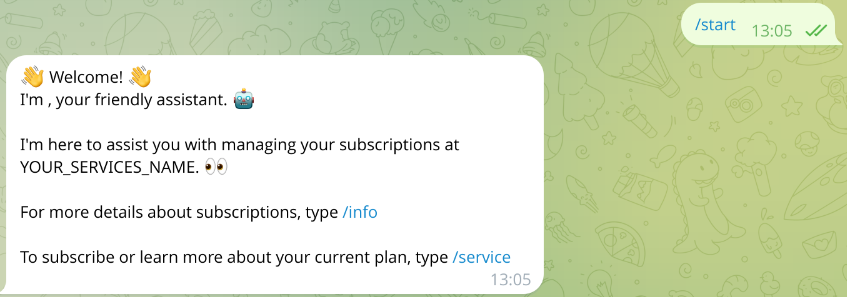
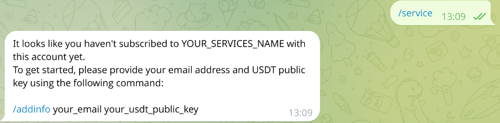
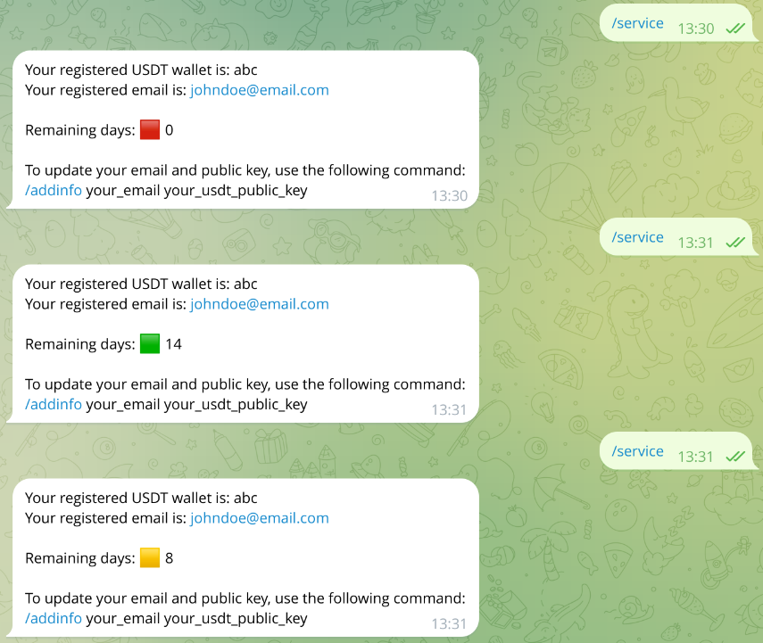
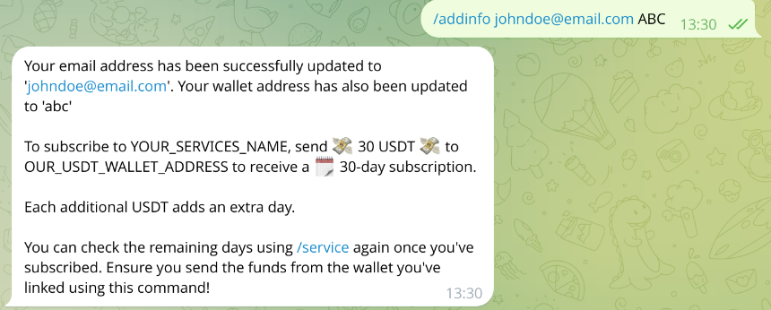
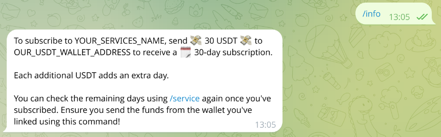

# Telegram USDT Subscription System for Ghost

This project provides a **self‑hosted Telegram bot** that lets readers buy and manage paid Ghost CMS memberships with **USDT (Tether) on Polygon** – completely automatically.

<p align="center">
        
</p>

---

## What it does

1. **Generates unique deposit addresses** for every prospective subscriber.
2. **Monitors the Polygon chain** for confirmed USDT transfers to those addresses.
3. When the payment arrives, **creates / extends the member** in Ghost via the Admin API (JWT).
4. **Sends the access‑link** back to the subscriber in Telegram.
5. A daily housekeeping job automatically **downgrades expired members** and frees their deposit addresses.

All the heavy lifting happens in **Python** – no third‑party SaaS, no fees except the on‑chain gas.

---

## Folder overview

| Path                                   | Purpose                                           |
| -------------------------------------- | ------------------------------------------------- |
| `main.py`                              | Telegram bot logic (command handlers, callbacks)  |
| `polygon.py`                           | Helpers for querying Polygon RPC / Polygonscan    |
| `daily.py`                             | Cron‑friendly script that expires overdue members |
| `add_members.py` & `remove_members.py` | Manual bulk‑tools                                 |
| `create_jwt_token.py`                  | Generates Ghost Admin JWT                         |
| `addresses.json`                       | Persistent mapping `deposit address → Member ID`  |
| `images/`                              | Screenshots used below                            |
| `requirements.txt`                     | Pinned Python dependencies                        |

---

## Installation

```bash
git clone https://github.com/leondeppe/Telegram-USDT-Subscription-System-For-Ghost.git
cd Telegram-USDT-Subscription-System-For-Ghost
python -m venv .venv && source .venv/bin/activate
pip install -r requirements.txt
```

### Environment variables

Create `.env` (or edit `creds.py`) and add:

| Name                  | Description                                     |
| --------------------- | ----------------------------------------------- |
| `BOT_TOKEN`           | Telegram bot token                              |
| `GHOST_ADMIN_API_URL` | e.g. `https://yourblog.com/ghost/api/admin/`    |
| `GHOST_ADMIN_JWT`     | Token generated by `create_jwt_token.py`        |
| `POLYGONSCAN_API_KEY` | Optional – faster confirmations                 |
| `WALLET_PRIVATE_KEY`  | Key that controls the pool of deposit addresses |

---

## Running the bot

```bash
python main.py   # starts the Telegram bot
```

### House‑keeping cron

```bash
0 3 * * * /path/to/venv/bin/python /path/to/daily.py >> /var/log/ghost_subscriptions.log 2>&1
```

---

## Bot command reference

### /start


### /addinfo



### /info



### /service1


### /service2


---

## Contributing

PRs and feature suggestions are welcome – especially support for additional chains (**TON**, **Solana**, etc.).
For major changes please open an issue first to discuss the scope.

---
